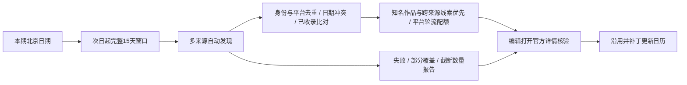

# 发售日历：封面规范与15天自动发现

## 已落地的展示规范

统一展示框，不改变来源图片比例。桌面160×160px；390px手机112×112px；320px窄屏96×96px。方形展示框采用主题次级底色与细边线，内边距6px，原图contain居中；横向商店图、竖版盒绘与方形封面均完整可见，不拉伸、不强制裁字。日期移到标题上方，封面与正文形成两列，保持游戏名的可读宽度。

没有核实封面和图片加载失败时，保留相同占位并说明原因，避免长清单跳动。图标继续使用Phosphor Regular。不为了统一比例生成假封面或更改已验证图片来源。

## 旧流程为什么会漏

1. 每期继承旧清单只能防止清单被清空，不能发现未曾收录的作品。
2. refreshRange只检查旧期次之后新增的末尾日期，误把“这期存在”视为“此前15天已查全”。早期遗漏会一直保留。
3. 单个商店的热门榜、第一页或官方博客都只是部分视图，且平台独占、地区日期、移植、抢先体验容易混淆。

## 自动流程

每日既有packet构建自动调用发现器，无需另设定时任务、第三方付费API或密钥。正常构建和SLA恢复均通过editorialize.mjs，使用同一逻辑。发售日历查询仅影响upcoming；正文事件仍遵守原packet证据边界。

| 来源 | 自动获取 | 作用与边界 |
|---|---|---|
| Steam Popular Upcoming | 待发售作品、日期、App ID | 优先捕获受关注PC作品；热门榜不代表全量 |
| Steam日期排序列表 | 最多4页 | 补充非热门新作；分页达到上限仍属部分覆盖 |
| Nintendo美国商店Coming Soon | 服务器内嵌产品数据、NSUID、平台、日期 | 捕获Switch与Switch 2；不代表日本/中国地区全量 |
| Xbox Wire Next Week on Xbox | 官方周报内明确的游戏链接和发售日 | 捕获Xbox新作与移植；周报不覆盖整15天 |
| PlayStation Blog RSS | 近21天内相关公告链接 | 提交待阅读公告，绝不把文章标题当游戏名或发文日当发售日 |
| GamesRadar跨平台月历 | 月份/年份标题下的明确日期游戏行 | 独立查漏线索；媒体日期不能直接当官方确认 |

来源配置位于config/release-calendar-sources.json。优先核验登记过的作品名、多个来源共同出现的作品，以及基线中没有的记录。按来源家族轮流分配候选位置，避免PC大量条目占满队列。不会凭关键词杜撰“知名度”或未经公开数据支持的愿望单数量。

## 采用之前必须核实的字段

编辑打开开发商/发行商或平台官方详情页，确认完整游戏身份、日期、地区、实际平台以及正式发售/抢先体验/移植/DLC/版本更新类型。中文名继续复用已有名称登记与官方大陆用语，不自动直译。封面沿用现有媒体验证流程，不因缺图删除游戏。

日期冲突保持待核，平台或地区不同的日期不能粗暴合并。必须复查旧清单中的延期和取消；查询失败、列表中消失均不足以作为删除依据。无法核实不填入已确认清单，在sourceReport说明限制。

## 查漏与运行可观测性

- 每天重新检查完整15天；不是只检查新增加的一天。
- 每次分别覆盖PC、PlayStation、Xbox、Nintendo；failed、empty_or_changed、partial_failure及只有文章线索的平台要做窄范围网络补查。
- HTTP成功不等于抓取成功，解析0项标记empty_or_changed；有列表也始终标记partial，不能宣称已查全。
- 日期严格过滤，不把月/季度/TBA推测成某一天。保留跨年窗口、产品ID、平台与来源。
- 抓取最多并发2个来源，单请求12秒、响应3.5MB上限；Steam最多4页，其余每源1页。来源失败不阻塞新闻生成；后续页失败时保留已成功获取的页。
- 完整发现报告写入artifacts/release-calendar-discovery.json并上传既有Actions artifact；GitHub步骤摘要展示来源状态和数量。packet最多100条候选，再按24,000字符上限收缩并记录omittedCandidates。完整报告与packet的计数可能不同。
- 输入预算提前计入日历资料，沿用既有正文候选预算规则，不增加模型总输入上限；若有截断，编辑必须对重点作品和薄弱平台补查，不能假装处理了被截断的记录。

发现层不直接写入public/data，不自动增加official事实，不自动发布候选。最终仍由既有编辑、可信publisher、双语、媒体与发布检查完成。

## 运行与验收

`npm run calendar:discover -- --date=2026-09-08` 可独立试运行。日期是期次的北京日期，输出窗口为9月9日至23日。

2026-09-08实测：Steam热门榜26条窗口内记录，日期列表4页40条，Nintendo7条，Xbox19条，跨平台月历24条；PlayStation提供3篇待阅读公告。跨页/来源归并与上限处理后输出100条候选记录，12条未纳入。不同平台版本不等于独立游戏数，以上不是已完成一手核验的发布数量。来源内容会随时间变化。

自动测试覆盖日期边界/跨年、模糊日期、平台身份、重复项、冲突日期、媒体线索分类、来源宕机、页面结构变化、体积和输入预算、真实packet构建断网，以及封面失败占位。

人工验收：1440/820/390/320px与深浅主题，横/竖/方封面不变形不裁字，长标题/平台名换行，Tab焦点与来源链接，日期/平台/地区准确性。遵守仓库约束，未执行Windows浏览器沙箱实屏验收。

## 参考

- [Steam官方待发售列表](https://store.steampowered.com/explore/upcoming/)
- [Steamworks发售日期说明](https://partner.steamgames.com/doc/store/release_dates)
- [Nintendo Coming Soon](https://www.nintendo.com/us/store/games/coming-soon/)
- [Xbox官方周报](https://news.xbox.com/en-us/tag/next-week-on-xbox/)
- [PlayStation官方博客](https://blog.playstation.com/)
- [GamesRadar跨平台月历（仅发现线索）](https://www.gamesradar.com/video-game-release-dates/)

本方案降低遗漏概率，不声称有完整的全球全平台发售数据库。还需要观察后续自然期次中被核实并实际纳入的新增作品，以及各平台持续缺口，才能评价覆盖改善效果。

最终自动检查：npm run check通过，68个测试文件、338项测试、29期数据与英文校验、生产构建。所有来源断网的真实packet构建测试通过，日历失败不会生成虚构条目。
